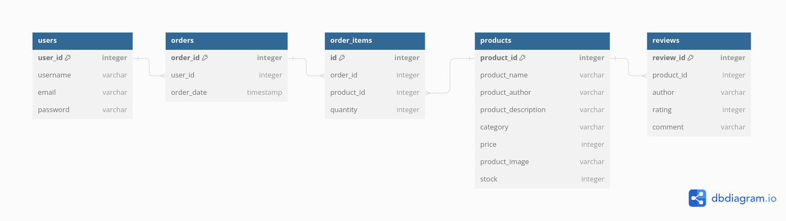

# E-Commerce Website -- Backend

This is a repo that holds backend functionality for an E-Commerce website created by Halimah, Oskar, Diana and Alex.

## Installation and initialisation

ere are instructions for how to install this locally on the repo:

1. Clone the repo

```bash
git clone https://github.com/fac29/hoda-e-commerce-backend.git
```

2. Navigate to the repo

```bash
cd hoda-e-commerce-backend
```

2. Install NPM packages

```bash
npm install
```

3. Create a .env file in the root directory `touch .env` and insert the following lines

```
PORT=3000
DB_FILE=./database/db.sqlite
```

4. [**optional**] Enter the following script to create the build - `dist/index.js` and run the server.

```bash
npm start
```

5. Enter the following script to seed database with example data from /database/seed.sql

```
npm run seed
```

6. Enter the following script to run the server in the development mode.

```bash
npm run dev
```

## Prettier configuaration

Prettier should be installed with other packages upon initialisation and utilise .prettierrc config file in the repo to ensure uniform formatting among contributors. For reference, the configuration is presented below:

```json
{
    "trailingComma": "es5",
    "tabWidth": 4,
    "singleQuote": true
}
```

## Database Schema



## API Endpoints

-   `GET /products/` - Retrieve a list of all products
-   `GET /products/:id` - Retrieve product by id
-   `GET /products?search=?` - Retrieve a list of products matching search string, e.g. `kill` would return To Kill a Mockingbird:
    ```json
    [
        {
            "product_id": 2,
            "product_name": "To Kill a Mockingbird",
            "product_author": "Harper Lee",
            "product_description": "A novel by Harper Lee, focusing on racial injustice in the Deep South.",
            "category": "Classic Literature",
            "price": 1299,
            "product_image": "to_kill_a_mockingbird.jpg",
            "stock": 30,
            "reviews": [
                {
                    "review_id": 4,
                    "author": "user2",
                    "rating": 5,
                    "comment": "Atticus Finch for President!"
                },
                {
                    "review_id": 5,
                    "author": "user3",
                    "rating": 4,
                    "comment": "The courtroom drama was intense!"
                },
                {
                    "review_id": 6,
                    "author": "user4",
                    "rating": 5,
                    "comment": "I want to be Scout when I grow up."
                }
            ]
        }
    ]
    ```
-   `POST products/checkout` - Checkout products. Here's a sample request body:

    ```json
    {
        "user_id": 3,
        "products": [
            {
                "product_id": 12,
                "quantity": 100
            },
            {
                "product_id": 11,
                "quantity": 99
            }
        ]
    }
    ```

If the order is successfully submitted you'll receive the following response on Postman: 'Order complete'.

-   `POST /sign-up` - Sign up as a user. Here's an example body you can use on Postman to test this works:

    ```json
    {
        "email": "betty@mail.com",
        "username": "Betty",
        "password": "d"
    }
    ```

-   `POST /login` - Login after creating a user. Here's an example body:

    ```json
    {
        "email": "betty@mail.com",
        "password": "d"
    }
    ```

-   `POST /logout` - Logout of the active session

## Testing

TBC
